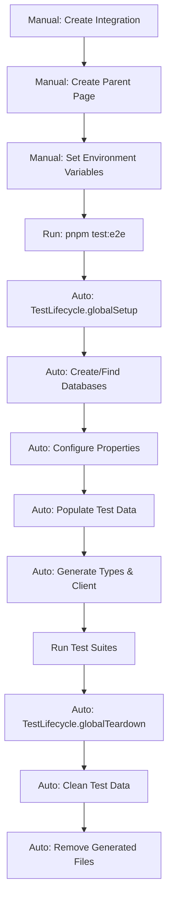

# E2E Test Setup Guide

## Overview

This guide clarifies the responsibilities between manual Notion UI setup and automated test scripts for E2E testing of notion-typed-client.

## Setup Responsibilities

### 📋 Manual Setup Requirements (One-time, via Notion UI)

These steps must be completed manually through the Notion UI before running E2E tests:

#### 1. Create Notion Integration
- Go to [https://www.notion.so/my-integrations](https://www.notion.so/my-integrations)
- Click "New integration"
- Configure:
  - Name: `notion-typed-client E2E Tests`
  - Associated workspace: Your test workspace
  - Capabilities: Read, Update, Insert content
- Copy the Internal Integration Token (starts with `secret_`)

#### 2. Create Parent Page for Tests
- Create a new page in your Notion workspace
- Name it: `E2E Test Container` (or any name you prefer)
- Share the page with your integration:
  - Click "Share" button
  - Invite your integration
  - Grant full access
- Copy the page ID from the URL:
  - URL format: `https://www.notion.so/Page-Name-{PAGE_ID}`
  - Copy the ID part (32 characters, may include hyphens)

#### 3. Configure Environment Variables
Create `e2e/.env.e2e` file:
```env
NOTION_API_KEY_E2E=secret_xxx  # Your integration token
NOTION_PARENT_PAGE_ID=xxx       # Your parent page ID
```

### 🤖 Automated Setup (Handled by Test Scripts)

The following are **automatically** handled by the test lifecycle and require **no manual intervention**:

#### Database Creation
- ✅ E2E Test Database (タスク管理)
- ✅ E2E Category Database (カテゴリ)
- ✅ Relation properties between databases

#### Property Configuration
All properties are created automatically with correct types:
- ✅ Title, Rich Text, Select, Multi-Select
- ✅ Number, Date, Checkbox, People
- ✅ Relation properties
- ⚠️ Status properties (skipped - API limitation)

#### Test Data Population
- ✅ Creates 12 test records with varied data
- ✅ Creates 4 category records
- ✅ Establishes relations between records

#### Type Generation
- ✅ Fetches database schemas from Notion
- ✅ Generates TypeScript types
- ✅ Creates type-safe client
- ✅ Validates generated code

## Test Lifecycle Flow



## Running E2E Tests

### Prerequisites Check
```bash
# Verify environment variables are set
cat e2e/.env.e2e

# Should show:
# NOTION_API_KEY_E2E=secret_xxx
# NOTION_PARENT_PAGE_ID=xxx
```

### Run Tests
```bash
# Run all E2E tests
pnpm test:e2e

# Run specific test suite
pnpm test:e2e typeGeneration

# Run with verbose logging
E2E_VERBOSE_LOGGING=true pnpm test:e2e
```

## What Happens During Setup

### First Run (No Existing Databases)
1. Creates new E2E Category Database
2. Creates new E2E Test Database with relations
3. Populates both databases with test data
4. Generates configuration file
5. Builds TypeScript types and client
6. Runs test suites

### Subsequent Runs (Databases Exist)
1. Finds existing databases by name
2. Cleans existing data (archives pages)
3. Repopulates with fresh test data
4. Regenerates types and client
5. Runs test suites

## Configuration Options

Environment variables (in `e2e/.env.e2e`):
```env
# Required
NOTION_API_KEY_E2E=secret_xxx
NOTION_PARENT_PAGE_ID=xxx

# Optional (with defaults)
E2E_TEST_TIMEOUT=300000        # 5 minutes
E2E_RATE_LIMIT_DELAY=350       # 350ms between API calls
E2E_CLEANUP_ON_SUCCESS=true    # Clean data after tests
E2E_VERBOSE_LOGGING=false      # Show detailed logs
```

## Troubleshooting

### Common Issues

#### "Missing required environment variable"
- Ensure `e2e/.env.e2e` exists with correct values
- Check that integration token starts with `secret_`

#### "Database creation failed"
- Verify integration has full access to parent page
- Check parent page ID is correct (32 characters)

#### "Rate limit exceeded"
- Increase `E2E_RATE_LIMIT_DELAY` to 500 or higher
- Notion API limit is 3 requests/second

#### Tests fail with "Status is not defined"
- This is expected - Status properties cannot be created via API
- Tests involving Status are automatically skipped

## Important Notes

### What You DON'T Need to Do Manually
- ❌ Create databases in Notion UI
- ❌ Configure database properties
- ❌ Add test data
- ❌ Set up relations between databases
- ❌ Generate TypeScript types
- ❌ Build the client

### API Limitations
- **Status Properties**: Cannot be created or configured via API. Tests involving Status properties are automatically skipped.
- **Formula/Rollup**: Read-only properties, not included in E2E tests
- **Database Deletion**: Not supported by API; tests use archiving instead

## Summary

**Manual setup = 2 things only:**
1. Create integration and get token
2. Create parent page and share with integration

**Everything else is automated** by the test lifecycle, ensuring consistent, repeatable test environments without manual database configuration.

## CI/CD Setup (GitHub Actions)

### Required GitHub Secrets

To run E2E tests in GitHub Actions, configure these secrets in your repository:

1. **Navigate to Settings**
   ```
   Repository → Settings → Secrets and variables → Actions → New repository secret
   ```

2. **Add Secrets**
   | Secret Name | Value |
   |------------|-------|
   | `NOTION_API_KEY_E2E` | Your Notion Integration Token (`secret_xxx`) |
   | `NOTION_PARENT_PAGE_ID` | Your parent page ID for test databases |

3. **Verify**
   - Create a PR that modifies `src/` or `e2e/` files
   - E2E tests will run automatically
   - Check Actions tab for results

### That's it!
The workflow (`.github/workflows/e2eTest.yml`) is already configured and will run automatically on PRs.