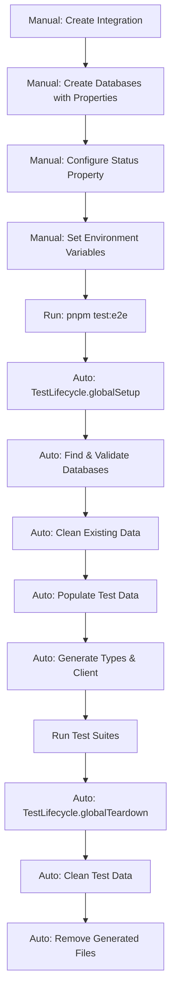

# E2E Test Setup Guide

## Overview

This guide explains how to set up the E2E testing environment for notion-typed-client. The setup requires manual database creation in Notion, followed by automated test execution.

## Important Note

⚠️ **Databases must be created manually** due to Notion API limitations. Certain property types (especially Status) cannot be created via API and require manual setup through the Notion UI.

## Setup Requirements

### 📋 Manual Setup (One-time, via Notion UI)

Complete these steps manually through the Notion UI before running E2E tests:

#### 1. Create Notion Integration
- Go to [https://www.notion.so/my-integrations](https://www.notion.so/my-integrations)
- Click "New integration"
- Configure:
  - Name: `notion-typed-client E2E Tests`
  - Associated workspace: Your test workspace
  - Capabilities: Read, Update, Insert content
- Copy the Internal Integration Token (starts with `secret_`)

#### 2. Create Test Databases
- **Follow the exact schema in [DATABASE_TEMPLATE.md](DATABASE_TEMPLATE.md)**
- Create two databases:
  1. `E2E Test Database` - Main test database with all property types
  2. `E2E Categories` - Category database for relation testing
- **Critical:** The Status property in the test database must be configured manually
- Share both databases with your integration (full access)

#### 3. Create Parent Page (Optional)
- Only needed if you want databases under a specific page
- Create a page named `E2E Test Container`
- Share with your integration
- Move databases under this page if desired

#### 4. Configure Environment Variables
Create `e2e/.env.e2e` file:
```env
NOTION_API_KEY_E2E=secret_xxx  # Your integration token
NOTION_PARENT_PAGE_ID=xxx       # Parent page ID (can be any page with access)
```

### 🤖 Automated Tasks (Handled by Test Scripts)

The following are **automatically** handled by the test lifecycle:

#### Database Validation
- ✅ Finds existing databases by name
- ✅ Validates all required properties exist
- ✅ Checks property types match expectations
- ✅ Reports missing or incorrect properties

#### Test Data Population
- ✅ Creates 12 test records with varied data
- ✅ Creates 4 category records
- ✅ Establishes relations between records

#### Type Generation
- ✅ Fetches database schemas from Notion
- ✅ Generates TypeScript types
- ✅ Creates type-safe client
- ✅ Validates generated code

## Test Lifecycle Flow



## Running E2E Tests

### Prerequisites Check
```bash
# Verify environment variables are set
cat e2e/.env.e2e

# Should show:
# NOTION_API_KEY_E2E=secret_xxx
# NOTION_PARENT_PAGE_ID=xxx
```

### Run Tests
```bash
# Run all E2E tests
pnpm test:e2e

# Run specific test suite
pnpm test:e2e typeGeneration

# Run with verbose logging
E2E_VERBOSE_LOGGING=true pnpm test:e2e
```

## What Happens During Setup

### Database Validation
1. Searches for databases by exact name match
2. Validates all required properties exist
3. Checks property types (title, text, select, status, etc.)
4. Reports any missing or misconfigured properties
5. Fails fast with clear error messages if validation fails

### Test Execution
1. Cleans any existing test data
2. Populates databases with fresh test data
3. Generates TypeScript types from actual schema
4. Creates type-safe client
5. Runs all test suites
6. Cleans up test data after completion

## Configuration Options

Environment variables (in `e2e/.env.e2e`):
```env
# Required
NOTION_API_KEY_E2E=secret_xxx
NOTION_PARENT_PAGE_ID=xxx

# Optional (with defaults)
E2E_TEST_TIMEOUT=300000        # 5 minutes
E2E_RATE_LIMIT_DELAY=350       # 350ms between API calls
E2E_CLEANUP_ON_SUCCESS=true    # Clean data after tests
E2E_VERBOSE_LOGGING=false      # Show detailed logs
```

## Troubleshooting

### Common Issues

#### "Database not found"
- Ensure database names exactly match: `E2E Test Database` and `E2E Categories`
- Verify databases are shared with your integration
- Check integration has full access
- See [DATABASE_TEMPLATE.md](DATABASE_TEMPLATE.md) for exact requirements

#### "Missing property: ステータス"
- The Status property must be created manually in Notion UI
- Cannot be created via API due to Notion limitations
- Follow the Status configuration in DATABASE_TEMPLATE.md

#### "Property has wrong type"
- Check property type matches DATABASE_TEMPLATE.md exactly
- Delete and recreate the property if needed
- Ensure property names use correct Japanese characters

#### "Missing required environment variable"
- Ensure `e2e/.env.e2e` exists with correct values
- Check that integration token starts with `secret_`

#### "Rate limit exceeded"
- Increase `E2E_RATE_LIMIT_DELAY` to 500 or higher
- Notion API limit is 3 requests/second

## Important Notes

### What You MUST Do Manually
- ✅ Create both test databases with exact names
- ✅ Configure all properties, especially Status
- ✅ Set up relation between databases
- ✅ Share databases with integration

### What's Automated
- ✅ Database discovery and validation
- ✅ Test data population and cleanup
- ✅ TypeScript type generation
- ✅ Client building and testing

### API Limitations
- **Status Properties**: Cannot be created via API, must be configured manually
- **Formula/Rollup**: Read-only properties, must be created manually if needed
- **Button**: Cannot be created via API
- **Database Deletion**: Not supported by API; tests use archiving instead

## Summary

**Manual setup required (one-time):**
1. Create Notion integration and get token
2. Create two databases following [DATABASE_TEMPLATE.md](DATABASE_TEMPLATE.md)
3. Configure Status property and other properties
4. Share databases with integration

**Everything else is automated**, including data population, type generation, and test execution.

## Quick Start

```bash
# 1. Create databases in Notion UI (see DATABASE_TEMPLATE.md)
# 2. Configure environment
cp e2e/.env.e2e.example e2e/.env.e2e
# Edit .env.e2e with your values

# 3. Run tests
pnpm test:e2e
```

## CI/CD Setup (GitHub Actions)

### Required GitHub Secrets

To run E2E tests in GitHub Actions, configure these secrets in your repository:

1. **Navigate to Settings**
   ```
   Repository → Settings → Secrets and variables → Actions → New repository secret
   ```

2. **Add Secrets**
   | Secret Name | Value |
   |------------|-------|
   | `NOTION_API_KEY_E2E` | Your Notion Integration Token (`secret_xxx`) |
   | `NOTION_PARENT_PAGE_ID` | Your parent page ID for test databases |

3. **Verify**
   - Create a PR that modifies `src/` or `e2e/` files
   - E2E tests will run automatically
   - Check Actions tab for results

### That's it!
The workflow (`.github/workflows/e2eTest.yml`) is already configured and will run automatically on PRs.